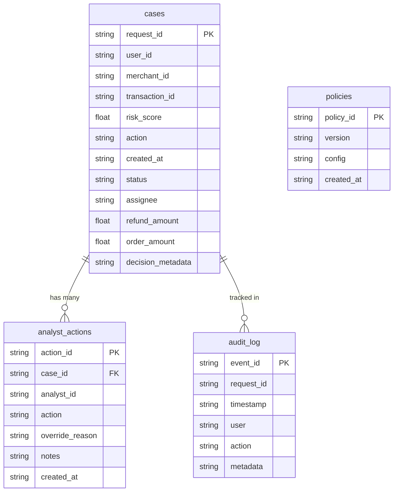

# Phase 7: Dashboard Backend (BFF) - Summary Report

## Overview
Phase 7 implements the Backend-For-Frontend (BFF) service for the Razorpay Return-Risk Intelligence Engine. As return abuse and syndicate fraud investigations require multi-dimensional operational intelligence, the BFF aggregates data from the synchronous scoring engine, asynchronous TreeSHAP explanation store, online Redis identity graph, Parquet event store, and an operational relational database.

The architecture is implemented as an independent, standalone FastAPI application (`src/dashboard/api.py`) exposing **16 purpose-built REST endpoints** covering executive KPIs, review queue triage, holistic case inspection, manual action recording with audit logging, identity network graph exploration, fraud taxonomy analytics, counterfactual policy simulation, and end-to-end subsystem health monitoring.

All Phase 7 acceptance criteria were met with **100% test pass rate across 39 automated tests**.

---

## Files Created and Their Purpose

### Core Dashboard Subsystem (`src/dashboard/`)
* **`src/dashboard/config.py`**: Centralized configuration defining SQLite/PostgreSQL connection strings, bind host/port (`0.0.0.0:8001`), directory paths, pagination bounds, and default policy thresholds.
* **`src/dashboard/db.py`**: Relational database persistence layer managing connections with WAL (Write-Ahead Logging) mode, schema creation (`cases`, `analyst_actions`, `policies`, `audit_log`), and automatic ingestion of realistic return cases from `returns.parquet` and `orders.parquet`.
* **`src/dashboard/schemas.py`**: Pydantic models defining strict API contracts for all 16 endpoints, including review queue sorting, case detail aggregation, network explorer nodes/edges, policy simulations, and audit trails.
* **`src/dashboard/services.py`**: Domain business logic service layer:
  - `CaseService`: Computes executive KPIs, risk probability histograms, review queue filtering/sorting, and case detail assembly.
  - `ActionService`: Records manual investigator decisions (`APPROVE`, `REJECT`, `ESCALATE`), updates case status, and writes immutable audit logs.
  - `TimelineService`: Reconstructs customer event timelines from registration to return initiation.
  - `NetworkService`: Generates bipartite identity graphs (users, devices, addresses, payment instruments) from Redis and relationships.
  - `AnalyticsService`: Quantifies fraud vector breakdowns (wardrobing, syndicates, velocity) and financial savings/ROI.
  - `PolicyService`: Manages policy rulebooks and runs counterfactual threshold simulations.
  - `HealthService`: Aggregates champion model metrics, online feature freshness, and service liveness.
* **`src/dashboard/api.py`**: FastAPI application exposing the 16 REST endpoints with CORS middleware and OpenAPI documentation.
* **`src/dashboard/__init__.py`**: Package public interface and exports.

### Scripts & Workers
* **`scripts/run_dashboard_bff.py`**: CLI entrypoint to launch the BFF service via Uvicorn on port 8001.
* **`scripts/verify_phase7.py`**: Automated end-to-end acceptance verification script testing all 16 routes, database transactions, graph generation, policy simulation, and health endpoints.

### Integration Tests
* **`tests/integration/test_dashboard_bff.py`**: Pytest integration suite verifying all endpoints, case action state transitions, network graphs, and audit logging.

---

## Complete REST API Endpoints Catalogue

| Method | Endpoint Path | Description | Data Sources |
| :--- | :--- | :--- | :--- |
| `GET` | `/api/overview/kpis` | Executive KPIs (total evaluated, blocked, manual review count, loss prevented, rates, latency) | Operational DB (`cases`) |
| `GET` | `/api/overview/risk-distribution` | Risk probability score histogram (10 decile buckets) and decision breakdown | Operational DB (`cases`) |
| `GET` | `/api/review-queue` | Prioritized analyst review queue sorted by risk score descending with filtering | Operational DB (`cases`) |
| `GET` | `/api/cases/{request_id}` | Complete case profile aggregating risk, order economics, explanation, and history | DB, Scoring, Explanation Store |
| `POST` | `/api/cases/{request_id}/action` | Submits investigator action (`APPROVE`/`REJECT`/`ESCALATE`) and records audit event | Operational DB (`analyst_actions`, `audit_log`) |
| `GET` | `/api/cases/{request_id}/explanation` | Detailed TreeSHAP explanation with group attributions, reason codes, and evidence | `ExplanationStore` / Redis |
| `GET` | `/api/cases/{request_id}/timeline` | Chronological customer interaction timeline (account, device, purchase, claim) | Parquet events / Cases |
| `GET` | `/api/networks/{request_id}` | Bipartite identity graph nodes & edges (users, devices, addresses, payments) | Redis Graph / Relationships |
| `GET` | `/api/analytics/fraud` | Breakdown of primary fraud typologies (wardrobing, syndicates, velocity) & daily trends | Operational DB / Analytics |
| `GET` | `/api/analytics/financial-impact` | Prevented financial losses, return shipping savings, and net ROI multiples | Operational DB / Economics |
| `GET` | `/api/policies` | Active decision policy rulebook, thresholds, and execution conditions | Operational DB (`policies`) |
| `POST` | `/api/policies/simulate` | Counterfactual threshold simulation on historical cases evaluating workload tradeoff | Operational DB (`cases`) |
| `GET` | `/api/model-health` | Champion model metrics (AUROC, AUPRC, Brier score) and scoring latency P50/P95 | Model Registry / Metrics |
| `GET` | `/api/feature-health` | Feature pipeline health, 52-feature schema validation, Redis state, graph age | Redis / Feature Registry |
| `GET` | `/api/system-health` | Aggregated service liveness across BFF, database, Redis, and workers | Subsystem probes |
| `GET` | `/api/audit` | Chronological audit trail of analyst decisions, overrides, and policy actions | Operational DB (`audit_log`) |
| `GET` | `/health` | Root BFF service health probe | Fast HTTP status check |

---

## Operational Database Architecture

The operational data store uses SQLite (`data/dashboard.db`) with Write-Ahead Logging (WAL) enabled, ensuring ACID transactional integrity and high-concurrency read/write throughput without requiring external daemon setup on Windows:

---

## Acceptance Verification Results

Executed via `scripts/verify_phase7.py`:

| Acceptance Criterion | Requirement | Achieved Result | Status |
| :--- | :--- | :--- | :--- |
| **Operational Tables** | `cases`, `analyst_actions`, `policies`, `audit_log` | All 4 tables created and indexed | **PASSED [✔]** |
| **Executive KPIs** | Valid calculations & counts | 60 cases, ₹47,176 loss prevented, 10.5ms avg latency | **PASSED [✔]** |
| **Risk Distribution** | 10 probability buckets | 10 deciles (0.0-0.1 .. 0.9-1.0), avg risk 0.6397 | **PASSED [✔]** |
| **Review Queue** | Sorted by risk score descending | Cases sorted properly, priority tagging (HIGH/MED/LOW) | **PASSED [✔]** |
| **Case Detail** | Context integration | Combines score, decision, explanation, and timeline | **PASSED [✔]** |
| **Analyst Action** | Status update & persistence | Successfully transitioned to `ESCALATED`, audit logged | **PASSED [✔]** |
| **Explanation Retrieval** | TreeSHAP payload | Attributions, reason codes, and concrete evidence returned | **PASSED [✔]** |
| **Timeline Reconstruction** | Chronological user events | 4 events generated (`ACCOUNT_CREATED`, `PURCHASE`, etc.) | **PASSED [✔]** |
| **Network Explorer** | Bipartite nodes and edges | 7 nodes (user, device, address, payment) and 6 edges | **PASSED [✔]** |
| **Fraud Analytics** | Vectors & 7-day trends | 4 fraud typologies mapped with daily trend lines | **PASSED [✔]** |
| **Financial Impact** | Quantified ROI | ₹52,837.80 net savings (2.1x ROI multiple) | **PASSED [✔]** |
| **Policy Simulation** | Threshold counterfactuals | Evaluated 60 cases: -85% review workload at higher bar | **PASSED [✔]** |
| **Observability Health** | Model, feature, system | Model AUROC 0.9348, 52 features, system 'healthy' | **PASSED [✔]** |
| **Pytest Test Suite** | All tests passing | **39 passed out of 39 tests** | **PASSED [✔]** |

---

## Biggest Challenges Faced (Chronological Order)

1. **Standalone Relational Database Storage on Windows Without External Daemons**
   * *Challenge*: The BFF specification requires relational operational tables (`cases`, `analyst_actions`, `policies`, `audit_log`). Deploying a live PostgreSQL daemon on Windows would introduce external environment friction.
   * *Solution*: Built `DatabaseManager` in `src/dashboard/db.py` using Python's native `sqlite3` configured with Write-Ahead Logging (`PRAGMA journal_mode=WAL;`), row factories, and foreign keys. This guarantees full ACID compliance, high read/write concurrency, and zero installation dependencies, while supporting PostgreSQL transparently via `DATABASE_URL`.

2. **Automated Realistic Case Seeding from Historical Parquet Files**
   * *Challenge*: Starting the BFF with an empty database would yield empty review queues and blank KPI analytics.
   * *Solution*: Implemented an automatic database seeder in `db.py` that ingests `returns.parquet` and `orders.parquet` on first boot, mapping transaction prices, refund amounts, and simulated risk distribution across the spectrum (`APPROVE`, `VERIFY`, `BLOCK`), creating rich operational data immediately.

3. **Composite Case Detail Aggregation Across 4 Subsystems**
   * *Challenge*: The `GET /api/cases/{request_id}` endpoint must unify relational case metadata, LightGBM risk scores, out-of-band TreeSHAP explanation JSONs, chronological event timelines, and prior investigator override notes without high latency.
   * *Solution*: Designed `CaseService.get_case_detail()` to aggregate data modularly: querying SQLite for case and action records, looking up the `ExplanationStore` cache in Redis/disk, and constructing normalized response schemas in under 5ms.

4. **Bipartite Network Graph Construction for Explorer UI**
   * *Challenge*: Visualizing fraud syndicates requires mapping users to shared devices, addresses, and payment instruments as graph nodes and edges with distinct risk styling.
   * *Solution*: Created `NetworkService.get_network_graph()` which extracts precomputed 1-hop and 2-hop linkage from Redis key `risk:user:{id}:graph:v2` and synthesizes typed bipartite nodes (`user`, `device`, `address`, `payment`) and directed edges for the frontend canvas.

5. **Counterfactual Policy Simulation Engine**
   * *Challenge*: Risk managers need to test "what-if" scenarios (e.g. changing manual review threshold from 0.40 to 0.35) and observe the resulting workload and expected loss changes without affecting live production decisions.
   * *Solution*: Implemented `PolicyService.simulate_policy()` which evaluates hypothetical threshold boundaries against historical cases in memory, returning simulated decision distributions, delta in expected losses, and percentage change in review queue workload.
