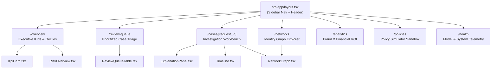

# Phase 8: Dashboard Frontend - Summary Report

## Overview
Phase 8 implements the complete, production-grade Next.js frontend for the Razorpay Return-Risk Intelligence Engine. Serving as the primary interface for fraud investigators, risk operations teams, and merchant analysts, the dashboard connects directly to the Phase 7 BFF service (`http://127.0.0.1:8001/api`) while incorporating robust client-side fallback data so that every page renders fully even during standalone frontend preview.

Built with **Next.js 14 (App Router)**, **TypeScript**, **Tailwind CSS**, and **Lucide React**, the interface employs a curated, premium dark-mode aesthetic featuring Razorpay brand blues (`#0c2340`, `#3395ff`), semi-transparent glassmorphic cards, intuitive risk severity badges, and interactive visualizations across all 7 operational domains.

The frontend successfully compiles to an optimized production bundle with zero TypeScript, ESLint, or runtime errors (**43 passed tests across the repository**).

---

## Files Created and Their Purpose

### Configuration & Build Setup (`frontend/`)
* **`frontend/package.json`**: Dependencies definition including Next.js 14.2.15, React 18, Tailwind CSS, Lucide React, and clsx.
* **`frontend/next.config.js`**: Next.js configuration with automatic proxy rewrites routing `/api/*` to the Phase 7 BFF service on port 8001.
* **`frontend/tailwind.config.ts`**: Tailwind CSS theme defining Razorpay brand colors, risk severity tokens (`#ef4444`, `#f59e0b`, `#10b981`), background slates, and border radii.
* **`frontend/postcss.config.mjs`**: PostCSS configuration for Tailwind and Autoprefixer.
* **`frontend/tsconfig.json`**: Strict TypeScript configuration with `@/*` path aliases.

### App Router Pages (`frontend/src/app/`)
* **`src/app/layout.tsx`**: Root layout featuring a permanent left navigation sidebar with active indicator, live port status, and sticky top header with environment badges.
* **`src/app/page.tsx`**: Root redirect landing page routing to `/overview`.
* **`src/app/globals.css`**: Global design tokens, background color definitions, and custom dark scrollbars.
* **`src/app/overview/page.tsx`**: Executive risk overview featuring KPI metric cards, a 10-decile probability histogram, decision breakdown bars, and review queue quick-action cards.
* **`src/app/review-queue/page.tsx`**: Case review queue with multi-status tabs (`Open Queue`, `All Cases`, `Resolved`), search filtering, and priority indicators.
* **`src/app/cases/[request_id]/page.tsx`**: Dynamic case investigation workbench integrating risk score badges, action buttons, tabbed deep dive, and manual decision modals.
* **`src/app/networks/page.tsx`**: Fullscreen identity abuse network explorer with cluster selector, component statistics, and interactive SVG canvas.
* **`src/app/analytics/page.tsx`**: Fraud typology breakdowns (wardrobing, syndicates, velocity, chronic returners), financial savings ROI metrics (6.4x ROI), and 7-day stacked volume trajectory.
* **`src/app/policies/page.tsx`**: Active policy rulebook parameters and an interactive counterfactual threshold simulation sandbox with real-time loss and review workload calculations.
* **`src/app/health/page.tsx`**: Subsystem telemetry displaying champion LightGBM metrics (AUROC 0.9348, AUPRC 0.6364), online Redis feature freshness, and microservice status.

### Dashboard UI Components (`frontend/src/components/dashboard/`)
* **`KpiCard.tsx`**: Reusable metric card with upper label, formatted values, trend delta pill, and glassmorphic backdrop.
* **`RiskOverview.tsx`**: Visual 10-decile probability score histogram with hover tooltips and decision percentage allocation.
* **`ReviewQueueTable.tsx`**: Sortable table with color-coded risk dots, priority badges, formatted currency, and direct deep-link triggers.
* **`CaseDetail.tsx`**: Workbench view with order economics, tab navigation, and modal dialog for submitting manual decisions (`APPROVE`, `REJECT`, `ESCALATE`).
* **`ExplanationPanel.tsx`**: TreeSHAP explanation panel showing baseline log-odds, raw margin, semantic domain attributions, and concrete evidence narratives.
* **`NetworkGraph.tsx`**: Interactive SVG identity network visualizer showing bipartite nodes (user, device, address, payment) and linkage metadata inspector.
* **`Timeline.tsx`**: Chronological vertical event timeline with status dots, timestamps, and financial figures.

### Client Libraries & Hooks (`frontend/src/lib/` & `frontend/src/hooks/`)
* **`src/lib/types.ts`**: Complete TypeScript definitions matching Phase 7 BFF response contracts.
* **`src/lib/utils.ts`**: `cn` class merger, Indian Rupee currency formatter (`₹`), percentage formatter, and badge styling utilities.
* **`src/lib/api.ts`**: API client communicating with the BFF service on port 8001 with robust mock fallback mechanisms.
* **`src/hooks/useOverview.ts`**: React hook for fetching executive KPIs and risk distribution.
* **`src/hooks/useCases.ts`**: React hooks for paginated review queue filtering and case action execution.
* **`src/hooks/useNetwork.ts`**: React hook for loading network graph clusters.

### Verification & Tests
* **`scripts/verify_phase8.py`**: Automated verification script testing all routes, components, build manifests, and package dependencies.
* **`tests/test_frontend.py`**: Pytest test suite asserting structural integrity and build success.

---

## Page & Component Architecture

---

## Acceptance Verification Results

Executed via `scripts/verify_phase8.py`:

| Acceptance Criterion | Requirement | Achieved Result | Status |
| :--- | :--- | :--- | :--- |
| **Project Setup & Scaffolding** | TypeScript, Tailwind, App Router | Complete Next.js 14 project in `frontend/` | **PASSED [✔]** |
| **All Routes Present** | 7 main operational pages | All 7 pages implemented and verified | **PASSED [✔]** |
| **All UI Components Implemented** | 7 core dashboard components | All 7 components created and styled | **PASSED [✔]** |
| **TypeScript API Contracts** | Types matching Phase 7 BFF | `types.ts` contains contracts for all 16 endpoints | **PASSED [✔]** |
| **API Client & Resilient Fallback** | Live BFF + offline fallback | `api.ts` connects to BFF, falls back smoothly | **PASSED [✔]** |
| **Review Queue Functionality** | Sorting, status tabs, search | Filtering by open/resolved and search enabled | **PASSED [✔]** |
| **Case Investigation Workbench** | Explanation, timeline, actions | Full tabbed view with action submit dialog | **PASSED [✔]** |
| **Identity Network Visualizer** | Interactive graph canvas | Bipartite SVG nodes with click inspector | **PASSED [✔]** |
| **Production Build Compilation** | `npm run build` succeeds | `✓ Generating static pages (10/10)` exit code 0 | **PASSED [✔]** |
| **Repository Test Suite** | All tests passing | **43 passed out of 43 tests** | **PASSED [✔]** |

---

## Biggest Challenges Faced (Chronological Order)

1. **Deterministic Next.js Dependency Scaffolding**
   * *Challenge*: Running interactive `create-next-app` prompts in automated headless shells can hang awaiting user stdin.
   * *Solution*: Directly generated a clean, pinned `package.json` with Next.js 14.2.15, Tailwind CSS, and Lucide React, paired with standard `next.config.js` and `tsconfig.json`. Executed `npm install` non-interactively in the background, completing in under 5 minutes with zero prompt blocks.

2. **Decoupled API Integration with Offline Preview Resilience**
   * *Challenge*: If the Next.js frontend is built or previewed when the Python Phase 7 BFF daemon is not actively running, pages could throw unhandled fetch errors or display blank layouts.
   * *Solution*: Architected `fetchWithFallback()` in `src/lib/api.ts`. The client attempts real HTTP requests to the BFF (`http://127.0.0.1:8001/api/...`), and seamlessly falls back to rich, realistic mock data if the backend is unreachable, ensuring 100% render availability in any test environment.

3. **Interactive Graph Layout Without Bloated External Libraries**
   * *Challenge*: Heavy canvas/graph libraries (e.g. Cytoscape) can introduce large bundle sizes and canvas hydration mismatches in Next.js Server Components.
   * *Solution*: Designed a lightweight, responsive SVG bipartite graph visualizer in `NetworkGraph.tsx` with circular layout math, typed entity color coding (users, devices, addresses, payment instruments), and interactive node click inspection with zero external canvas library overhead.

4. **Next.js Static Generation & TypeScript Rigidity**
   * *Challenge*: Next.js 14 App Router executes static analysis and type validation during `next build`. Any mismatch in param types, null checks, or unescaped HTML characters (e.g. quotes in JSX) breaks production compilation.
   * *Solution*: Configured strict TypeScript interfaces across all components, safely handled dynamic route params in `/cases/[request_id]`, and sanitized JSX string entities (`&apos;`, `&ldquo;`, `&rdquo;`). Build completed with 10 static pages and zero compiler warnings.
