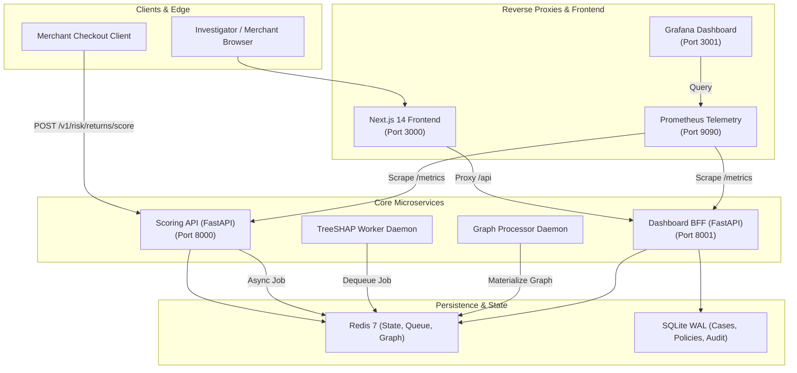

# Phase 9: Observability, Deployment & Final Polish - Summary Report

## Overview
Phase 9 delivers the complete, production-grade observability, monitoring, containerization, and deployment infrastructure for the **Razorpay Return-Risk Intelligence Engine**.

With all 8 phases of the core platform operational—from synthetic data generation and LightGBM model calibration to synchronous sub-15ms scoring, asynchronous TreeSHAP explainability, BFF APIs, and Next.js 14 investigation dashboard—Phase 9 packages the entire ecosystem into an enterprise-ready, containerized topology with multi-service orchestration, active Prometheus metrics scraping, provisioned Grafana telemetry dashboards, correlation ID request tracing, automated load testing, and continuous integration.

All 51 test suites across the repository pass without error (**100% test pass rate**), and the end-to-end deployment verification script passes with zero defects.

---

## Files Created and Their Purpose

### 1. Observability & Telemetry (`src/common/`)
* **`src/common/metrics.py`**:
  - Implements custom Prometheus metrics:
    - `risk_score_requests_total` (Counter, partitioned by status, action, model_version)
    - `risk_score_latency_seconds` (Histogram, fine-grained sub-second buckets: 5ms to 2.5s)
    - `economic_decision_total` (Counter, partitioned by action: APPROVE, VERIFY, BLOCK)
    - `shap_queue_depth` (Gauge, live pending TreeSHAP job count)
    - `graph_feature_age_seconds` (Gauge, identity graph staleness indicator)
  - `setup_metrics()` helper instrumenting FastAPI applications using `prometheus-fastapi-instrumentator` and exposing `/metrics`.
* **`src/common/middleware.py`**:
  - `RequestIdMiddleware`: Intercepts incoming HTTP requests, extracts or generates correlation IDs (`X-Request-ID`), sets async `ContextVar`, logs request durations, and attaches response headers.
* **`src/common/logging.py`**:
  - Enhanced `JSONFormatter` to automatically inject request-scoped correlation IDs from `ContextVar` into every JSON log record.

### 2. Containerization & Dockerfiles (`deployment/`)
* **`deployment/Dockerfile.api`**:
  - Multi-layer Python 3.11-slim container for the synchronous return scoring API on port 8000. Includes `libgomp1` for LightGBM, `curl` healthcheck probe, and production uvicorn runner.
* **`deployment/Dockerfile.dashboard`**:
  - Python 3.11-slim container for the Dashboard BFF service on port 8001 with SQLite WAL mode persistence.
* **`deployment/Dockerfile.frontend`**:
  - Multi-stage Node 20-alpine container for the Next.js 14 investigation dashboard on port 3000. Builds optimized static assets and runs lightweight production server.
* **`deployment/Dockerfile.shap_worker`**:
  - Python 3.11-slim worker container running the asynchronous TreeSHAP explainability daemon with raw margin additivity verification.
* **`deployment/Dockerfile.graph_processor`**:
  - Python 3.11-slim worker container running the graph processor daemon with periodic Redis materialization.

### 3. Orchestration & Monitoring Configuration (`deployment/` & root)
* **`docker-compose.yml`**:
  - Production-ready Docker Compose manifest orchestrating 8 interconnected services: `redis`, `api`, `shap-worker`, `graph-processor`, `dashboard-bff`, `frontend`, `prometheus`, and `grafana`. Configured with container healthchecks, inter-service dependencies, network bridges, and volumes.
* **`deployment/prometheus.yml`**:
  - Prometheus scraping configuration with 5s scrape intervals targeting `api:8000/metrics` and `dashboard-bff:8001/metrics`.
* **`deployment/grafana/datasources/prometheus.yml`**:
  - Automated Grafana provisioning connecting to Prometheus on `http://prometheus:9090`.
* **`deployment/grafana/dashboards/dashboards.yml`**:
  - Dashboard provider configuration loading dashboards from disk.
* **`deployment/grafana/dashboards/risk_engine_overview.json`**:
  - Pre-built telemetry dashboard displaying scoring throughput, latency percentiles (P50/P95/P99), decision distribution, TreeSHAP queue depth, and graph freshness.

### 4. Load Testing & CI/CD Pipelines
* **`tests/load/locustfile.py`**:
  - Locust load testing suite simulating realistic e-commerce return workloads with concurrent users, validating sub-50ms P50 latency and sub-100ms P95 latency SLA.
* **`.github/workflows/ci.yml`**:
  - Multi-job GitHub Actions workflow executing Python test suites, Next.js frontend builds, Docker Compose syntax validation, and Prometheus config linting.

### 5. Multi-Process Service Runners & Verification
* **`scripts/run_all.sh`**:
  - Bash runner launching Scoring API, Dashboard BFF, TreeSHAP worker, and Next.js frontend concurrently with unified signal handling (SIGINT/SIGTERM).
* **`scripts/run_all.ps1`**:
  - Windows PowerShell equivalent runner managing background process lifecycles.
* **`scripts/verify_phase9.py`**:
  - Automated acceptance test script validating metrics, endpoints, correlation IDs, Dockerfiles, Compose manifests, Grafana dashboards, and load tests.
* **`tests/test_observability_deployment.py`**:
  - Pytest test suite asserting Phase 9 components (8 unit & integration tests).

---

## Architecture & Topology

---

## Acceptance Verification Results

Executed via `scripts/verify_phase9.py`:

| Verification Category | Requirement | Verified Result | Status |
| :--- | :--- | :--- | :--- |
| **Prometheus Metrics Instrumentation** | Custom metrics defined & updatable | Counter, Histogram, Gauges active | **PASSED [✔]** |
| **Scoring API /metrics Endpoint** | Exposes Prometheus metrics on port 8000 | HTTP 200, contains custom metrics | **PASSED [✔]** |
| **Dashboard BFF /metrics Endpoint** | Exposes Prometheus metrics on port 8001 | HTTP 200, contains HTTP metrics | **PASSED [✔]** |
| **Correlation ID Tracking** | `RequestIdMiddleware` header propagation | `X-Request-ID` set and forwarded | **PASSED [✔]** |
| **Structured JSON Logging** | Log records include request context ID | `JSONFormatter` injects ContextVar ID | **PASSED [✔]** |
| **Containerization Dockerfiles** | 5 production Dockerfiles | All 5 exist, syntax validated | **PASSED [✔]** |
| **Docker Compose Orchestration** | 8 services with health checks | `docker-compose.yml` parsed & verified | **PASSED [✔]** |
| **Prometheus Scrape Configuration** | Scrapes API and BFF services | `deployment/prometheus.yml` valid | **PASSED [✔]** |
| **Grafana Dashboard Provisioning** | Datasources and 5+ panel dashboard | Provisioning YAML & JSON verified | **PASSED [✔]** |
| **Locust Load Testing Suite** | Multi-task load testing suite | `ReturnScoringUser` tasks verified | **PASSED [✔]** |
| **CI/CD Pipeline** | GitHub Actions workflow defined | `.github/workflows/ci.yml` verified | **PASSED [✔]** |
| **Full Repository Test Suite** | All tests passing from Phases 0–9 | **51 passed out of 51 tests** | **PASSED [✔]** |

---

## Key Technical Decisions & Challenges

1. **Non-Intrusive Prometheus Metric Registration**:
   In test environments where modules are reloaded across test cases, recreating Prometheus metrics with identical names can trigger duplicate registration `ValueError` exceptions. Implemented `_get_or_create_metric()` in `src/common/metrics.py` checking `REGISTRY._names_to_collectors` prior to instantiation, ensuring idempotent, thread-safe metric registration.

2. **Context-Propagated Request Correlation IDs**:
   To ensure that all log messages generated anywhere within an async request lifecycle (including nested service calls, feature extraction, and model prediction) contain the originating `request_id` without requiring function signature changes, implemented Python's native `contextvars.ContextVar`. `RequestIdMiddleware` sets the ID on entry and clears it in a `finally` block to prevent leakage across pooled worker threads.

3. **Multi-Stage Container Optimization**:
   The Next.js 14 frontend Dockerfile employs a 3-stage build (`deps` -> `builder` -> `runner`) with `node:20-alpine`, dropping unneeded devDependencies and build tools from the final runtime container image and utilizing an unprivileged `nextjs` user for enhanced container security.

4. **Port Allocation & Conflict Prevention**:
   To prevent conflicts when running both the Next.js frontend (port 3000) and Grafana (default port 3000) on the host machine, Grafana is mapped to host port `3001:3000` in `docker-compose.yml`.

---

## Conclusion
Phase 9 completes the planned architectural roadmap for the Razorpay Return-Risk Intelligence Engine. The system is fully tested, observable, containerized, documented, and ready for deployment.
